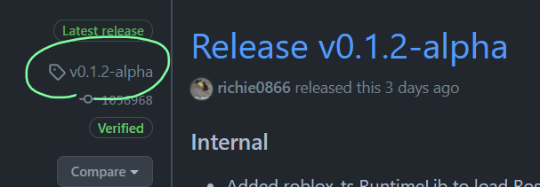

# Setup

Learn how to integrate Rostruct into your workflow.

!!! warning
	Automatically getting the latest Rostruct release is discouraged, as **breaking changes** can happen at any time.
	
	Read the changelogs when updating Rostruct just in case you need to change your code.

## Installation

Rostruct is distributed as a Lua file. Before starting your local project, you'll need to set it up with your exploit.

### with HTTP GET <small>recommended</small> { data-toc-label="with HTTP GET" }

Rostruct can be installed with `HttpGetAsync`:

```lua hl_lines="1"
local VERSION = "TAG_VERSION_HERE"
local URL = "https://github.com/richie0866/Rostruct/releases/download/%s/Rostruct.lua"
local Rostruct = loadstring(game:HttpGetAsync(string.format(URL, VERSION)))()
```

This will load the Rostruct script for the given [GitHub Release](https://github.com/richie0866/Rostruct/releases) **tag version**.

??? tip "How do I get the tag version?"
	{ align=right width=512 }

	The tag version is **not** the name of the release.
	
	You can find the tag version to the left of the release name:

### with `#!lua loadfile()`

Storing Rostruct in the filesystem is a great way to cut down loading times during development. Save the latest `Rostruct.lua` file from the [GitHub Releases page](https://github.com/richie0866/Rostruct/releases/latest) to your executor's `workspace/` directory. You can load the Lua file with:

=== "loadfile"

	```lua
	local Rostruct = loadfile("Rostruct.lua")()
	```

=== "loadstring-readfile"

	```lua
	local Rostruct = loadstring(readfile("Rostruct.lua"))()
	```
