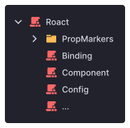

# Getting started

With **Rostruct**, script executors can deploy your Lua projects from the filesystem. Integrate powerful tools like [Rojo](https://rojo.space/docs/) and [Selene for VS Code](https://marketplace.visualstudio.com/items?itemName=Kampfkarren.selene-vscode) into your workflow, ensuring a hassle-free development experience.

This documentation is a work in progress!

## What you need to know

This guide assumes:

- [x] You're familiar with development in an external code editor.
  * If you're unsure of how to manage Roblox projects externally, [Rojo's documentation](https://rojo.space/docs/) provides an in-depth explanation of how it works and why you should do it.

- [x] You understand how to use Promises.
  * You can refer to evaera's [Promise documentation](https://eryn.io/roblox-lua-promise/) for a detailed guide. 

## Why Rostruct?

When it comes to exploiting, developers often write their projects as a single Lua file. However, large, messy scripts are detrimental to your workflow, as they make debugging, management, and working in teams difficult.

In contrast, if you've ever used Rojo with Roblox Studio, you're able to distribute your codebase between separate, specialized files. Taking a **modular approach** to development can improve how you plan, design, and maintain your codebase.

Rostruct's design complements a Rojo-based workflow, introducing script developers to a professional way to manage projects. Host your project files in your exploit's `workspace/` directory, allowing for a more professional developing environment.

---

{ align=right width=200 draggable=false }

### Built for ambitious projects

Rostruct executes multiple files at once, so you can focus on making your code readable, without worrying about the implementation.

Create projects from UI libraries to explorers - with little to no limitations.

---

### Asset management

Store all of your UI, modules, and assets locally, and they'll be loaded as Roblox objects before runtime.

Write your code without waiting for assets.

{ align=right width=200 draggable=false }

```lua
local midiPlayer = script:FindFirstAncestor("MidiPlayer")

local Signal = require(midiPlayer.Util.Signal)
local Date = require(midiPlayer.Util.Date)
local Thread = require(midiPlayer.Util.Thread)

local gui = midiPlayer.Assets.ScreenGui

gui.Parent = gethui()
```

---

### Use other projects

Don't want to make a project? Integrate Rostruct projects into your script with an intelligent Promise-based module system.

Restructuring your script for Rostruct is completely optional.

{ align=right width=200 draggable=false }

```lua
local download = Rostruct.DownloadLatestRelease(
	"Roblox",
	"roact"
):expect()

local project = Rostruct.Require(download.Location .. "src/")
project.Instance.Name = "Roact"

return project.Module:expect()
```

---

{ align=right width=180 draggable=false }

### Test at any time

Design your project with Rojo, a popular tool used to sync an external code editor with Roblox Studio. Develop your project during exploit downtime.

Rostruct brings the modern game development workflow to exploiting.

---

### Recommended tools

Rostruct can (and should!) be paired with helpful tools like:

* [Rojo](https://rojo.space/docs/) - a project management tool designed to get professional resources in the hands of Roblox developers
* [Roblox LSP](https://devforum.roblox.com/t/roblox-lsp-full-intellisense-for-roblox-and-luau/717745) - full intellisense for Roblox and Luau in VS Code
* [Selene for VS Code](https://marketplace.visualstudio.com/items?itemName=Kampfkarren.selene-vscode) - a static analysis tool to help you write better Lua
